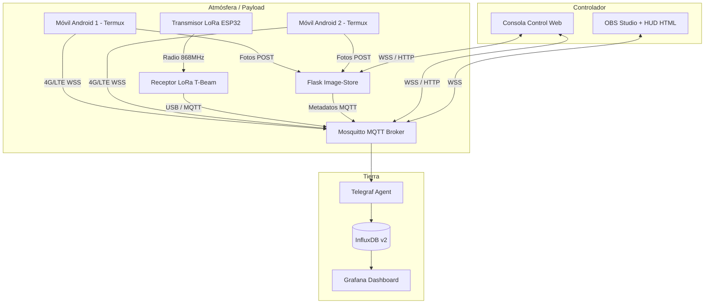

# 🛰️ Proyecto Stratocaster (Sonda IoT Multi-dispositivo)

Ecosistema completo de software y hardware para el control, adquisición de telemetría y transmisión en directo de sondas atmosféricas/meteorológicas mediante múltiples dispositivos redundantes.

El proyecto permite rastrear la posición, altitud, velocidad y datos físicos de la sonda en tiempo real combinando transmisiones por radio LoRa (868 MHz) y enlaces de datos móviles 4G/LTE (con captura de imágenes por IA en la nube y streaming WebRTC).

---

## 🏗️ Arquitectura General



---

## 📂 Estructura del Repositorio

El proyecto está organizado en las siguientes carpetas:

* 📂 **`codigo/`**
  * 📱 `Android/`: Scripts de Termux ([sonda_loop.sh](file:///home/marti/Documentos/Personal/Sonda/codigo/Android/sonda_loop.sh)) para control y captura autónoma en vuelo.
  * 🛰️ `RXLora/`: Firmware del receptor de tierra LoRa ([RXLora.ino](file:///home/marti/Documentos/Personal/Sonda/codigo/RXLora/RXLora.ino)) en ESP32.
  * 🚀 `TXLora/`: Firmware del emisor de abordo LoRa ([TXLora.ino](file:///home/marti/Documentos/Personal/Sonda/codigo/TXLora/TXLora.ino)) con módulo GPS.
  * 📺 `HUD/`: Interfaz gráfica HUD en HTML ([telemetria.html](file:///home/marti/Documentos/Personal/Sonda/codigo/HUD/telemetria.html)) diseñada para integrarse como fuente web en OBS.
* 📂 **`docker-TIG/`**
  * Configuración del stack de base de datos y paneles de visualización (InfluxDB, Telegraf, Mosquitto, Grafana).
* 📂 **`docker-broadcast/`**
  * Servidor web Flask (`image-store`) para almacenamiento de fotos enviadas por los móviles en vuelo y la consola web de control pre-vuelo.
* 📂 **`docs/`**
  * Guías específicas, manuales y registro histórico del proyecto (incluye el manual de instalación de Termux, diagramas de flujo y plan de arquitectura).

---

## 📋 Documentación de Referencia

Para operar el sistema, consulta los siguientes manuales detallados:

1. 📖 **Manual de Operaciones:** [manual_operaciones.md](file:///home/marti/Documentos/Personal/Sonda/manual_operaciones.md) — Procedimiento paso a paso para el despliegue del servidor, preparación de abordo, checklist pre-vuelo y fases de misión.
2. 📱 **Instalación en Móviles (Termux):** [instalacion_termux.md](file:///home/marti/Documentos/Personal/Sonda/docs/instalacion_termux.md) — Configuración del entorno de Android, permisos de GPS/cámara y clonado de scripts.
3. 🗺️ **Esquema Multi-dispositivo:** [plan_arquitectura_multidispositivo.md](file:///home/marti/Documentos/Personal/Sonda/plan_arquitectura_multidispositivo.md) — Especificación de los canales de MQTT jerárquicos y formato de datos.
4. ⚙️ **Protocolo de Lanzamiento:** [flujo_lanzamiento.md](file:///home/marti/Documentos/Personal/Sonda/docs/flujo_lanzamiento.md) — Diagrama de secuencias y comandos de control pre-vuelo.
5. 📝 **Registro de Cambios:** [devlog.md](file:///home/marti/Documentos/Personal/Sonda/devlog.md) — Historial detallado de sesiones de ingeniería.

---

## ⚡ Inicio Rápido

### 1. Iniciar Servidor (Tierra)
Asegúrate de configurar los archivos `.env` (usa `.env.example` como plantilla) y levanta los contenedores Docker:
```bash
# Iniciar base de datos e ingesta (TIG)
cd docker-TIG
docker compose up -d

# Iniciar servidor de imágenes y control
cd ../docker-broadcast
docker compose up -d
```

### 2. Configurar Móviles (Abordo)
Copia el script `sonda_loop.sh` y configura su identificador único en `sonda.env`:
```env
DEVICE_ID="movil_sonda_1"
MQTT_HOST="stratocaster.martivich.es"
MQTT_PORT=1883
MQTT_USER="tu_usuario"
MQTT_PASS="tu_contraseña"
```

### 3. Monitorizar el Vuelo
* **Consola de Control:** `https://stratocaster.martivich.es/control?device_id=movil_sonda_1`
* **HUD de OBS:** Cargar localmente o por web `telemetria.html?device_id=movil_sonda_1`
* **Grafana (Histórico):** Acceder a `https://stratocaster.martivich.es/grafana/`
