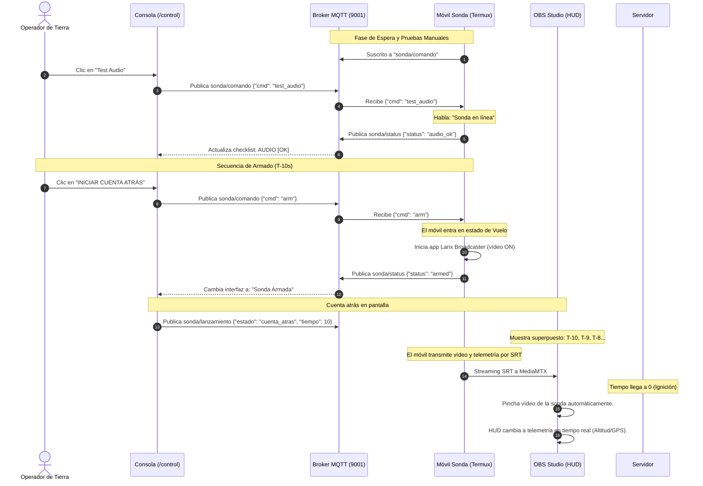

# 🛰️ Especificación Técnica: Consola de Control de Tierra y Protocolo Pre-Vuelo

Este documento describe la arquitectura para la consola de control `/control` (alojada en el miniservidor N100), el protocolo de comandos MQTT bidireccionales para la batería de pruebas de la sonda antes del lanzamiento, y la secuencia de armado a partir de T-10 segundos.

---

## 🔌 1. Arquitectura de Comunicación Bidireccional (MQTT + WebSockets)

Para permitir que el operador controle la sonda en tiempo real y realice diagnósticos antes del lanzamiento, utilizaremos **MQTT** como canal de comandos.
La consola web `/control` (que se ejecuta en el navegador del operador o de OBS) se conecta al broker MQTT por WebSockets (puerto `9001`), permitiendo el envío de comandos instantáneos y la recepción de telemetría.

### Topics de Control:
1. **`sonda/comando` (Tierra -> Sonda):** Canal por donde el operador envía órdenes a la sonda.
2. **`sonda/status` (Sonda -> Tierra):** Canal por donde la sonda responde con telemetría de diagnóstico (batería, señal, sensores).

---

## 🛠️ 2. Batería de Pruebas Pre-Vuelo (Checklist)

Antes de iniciar la cuenta atrás, la consola web `/control` presentará un checklist interactivo. El operador enviará comandos JSON al móvil de la sonda y este responderá para marcar el test como superado:

| Test / Función | Comando JSON (`sonda/comando`) | Acción de la Sonda (Termux) | Respuesta JSON (`sonda/status`) |
| :--- | :--- | :--- | :--- |
| **1. Estado de Batería** | `{"cmd": "get_battery"}` | Corre `termux-battery-status` | `{"status": "battery_ok", "level": 92, "temp": 28.5}` |
| **2. Cobertura GPS** | `{"cmd": "get_gps"}` | Corre `termux-location` | `{"status": "gps_ok", "lat": 39.54, "lng": 2.41, "alt": 45.2}` |
| **3. Test de Audio** | `{"cmd": "test_audio"}` | Reproduce un mensaje TTS de voz | `{"status": "audio_ok", "msg": "Test de audio completado"}` |
| **4. Test de Streaming (ON)** | `{"cmd": "test_video_on"}` | Abre Larix Broadcaster (inicia vídeo) | `{"status": "video_streaming_on"}` |
| **5. Test de Streaming (OFF)** | `{"cmd": "test_video_off"}`| Cierra Larix (vuelve a espera) | `{"status": "video_streaming_off"}` |
| **6. Apagado / Reinicio** | `{"cmd": "reboot"}` | Reinicia el terminal móvil | `{"status": "rebooting"}` |

---

## 🚀 3. El Flujo de Armado y Lanzamiento (T-10 Segundos)

Una vez que el operador completa la batería de pruebas y verifica que todo está en "verde", se procede al armado:



### Comportamiento detallado en T-10:
1. Al recibir la orden de **Armado** (`{"cmd": "arm"}`), la sonda **inicia la transmisión de vídeo inmediatamente** (abre Larix Broadcaster).
2. La sonda empieza a transmitir telemetría básica (GPS y altitud) a intervalos de 5 segundos.
3. El operador en tierra ve la señal de vídeo de la sonda en MediaMTX antes del despegue físico.
4. OBS y el HUD inician la cuenta atrás visual de 10 segundos sobre la pantalla.
5. Durante los 10 segundos de la cuenta atrás, la sonda ya está en vuelo/armada recopilando y enviando los primeros datos.
6. A partir de este momento, **se desactiva la recepción de comandos de prueba** en el móvil; la sonda entra en modo autónomo de seguimiento del protocolo de vuelo.

---

## 📱 4. Lógica de Ejecución en Termux

El script de la sonda implementará la siguiente estructura en Bash:

```bash
# 1. Bucle de Diagnóstico (Pre-vuelo)
# Escucha el topic sonda/comando en segundo plano usando mosquitto_sub.
# Procesa comandos usando un simple "case" en bash.
# Permanece en este bucle hasta recibir la orden "arm".

# 2. Transición y Lanzamiento (T-10)
# - Inicia Larix Broadcaster: am start -n com.wmspanel.larix_broadcaster/.MainActivity
# - Lanza en segundo plano un bucle de telemetría que publica en "gps/data" (cada 5s).
# - Comienza a medir la altitud.

# 3. Fase Autónoma (>1000m)
# - Ejecuta: am force-stop com.wmspanel.larix_broadcaster
# - Inicia el bucle de cámara local e inferencia IA con Qwen3-VL.
```

---

## 🖥️ 5. Diseño del Panel de Control de Tierra (`/control`)

La interfaz HTML de la consola de tierra presentará:
* **Dashboard de diagnóstico:**
  * Indicador de batería del teléfono (nivel y temperatura).
  * Estado de la cobertura GPS de la sonda (Lat, Lng, Alt y precisión).
* **Consola de mandos de prueba:**
  * Botones de acción instantánea para mandar comandos (`test_audio`, `test_video_on`, `test_video_off`).
* **Estado de seguridad:**
  * Indicador visual de checklist: "Sonda en Espera" (Rojo) $\rightarrow$ "Checklist Aprobado" (Verde).
* **Botón de Armado:**
  * Bloqueado por defecto. Se activa únicamente cuando se han verificado los sistemas.
  * Al pulsarse, envía la orden de armado y desencadena la cuenta atrás visual en la pantalla de realización (OBS).
